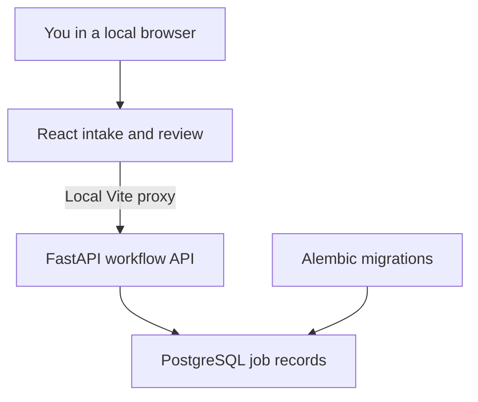
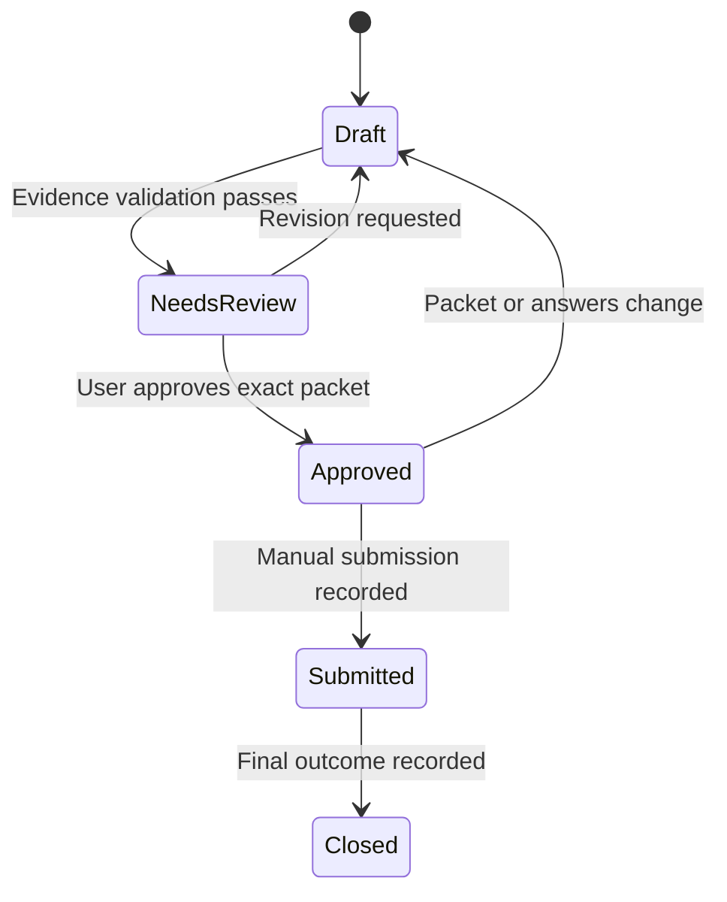

# Architecture and workflow decisions

## Product contract

Reduce repetitive application work while retaining accurate qualifications, meaningful tailoring and explicit human control. There is no guarantee of employment or inferred interview/hire probability. The system should make uncertainty and missing evidence visible.

## Phase 1 topology

The Python and React development processes run directly on the Mac. Only PostgreSQL runs in Docker. This keeps debugging in VS Code straightforward and avoids requiring application containers before the workflow is established.

## Technical decisions

| Decision | Reason and consequence |
| --- | --- |
| One FastAPI application | Easier to develop and test than multiple services; modules can separate intake, scoring, drafting and tracking later. |
| Synchronous SQLAlchemy sessions | Adequate for a single-user workflow and simpler to learn; reassess concurrency only after measuring demand. |
| PostgreSQL from the start | Durable relational links between jobs, evidence, drafts, approvals and outcomes. SQLite is a test substitute only. |
| Alembic migrations | Database changes are explicit, reviewable Git artifacts; application startup never silently creates tables. |
| React with Vite | A small local UI; the development proxy avoids cross-origin configuration for this setup. |
| JavaScript initially | Aligns with existing JavaScript experience; TypeScript can follow if complexity warrants it. |
| Provider-neutral LLM adapter later | Prompt construction, response validation and model-provider calls remain separate from database and scoring logic. No provider key is needed for Phase 1. |
| Git for code; separate private document versions | Public commits demonstrate engineering without committing confidential career documents. Git alone is not the private document version store. |

## Job intake contract

`POST /jobs` accepts manually supplied company, title, full description, optional original URL, and either `pasted` or `daily_feed_manual` provenance. The stored URL is a reference; the API does not fetch it. `GET /jobs` supports a bounded limit and offset; the initial UI shows the latest 50. `GET /jobs/{id}` returns the full record.

The description is preserved after outer whitespace trimming. Deduplication hashes company, title and description after whitespace/case normalization; it is conservative and does not claim two different postings are the same vacancy. Changed descriptions can create new records. A later source adapter should add source-specific posting IDs and version linkage.

The Daily Healthcare Tech Jobs report is currently copied manually. This project has no automatic access to ChatGPT conversations, scheduled reports, LinkedIn or private feeds. A later connector requires an actual authorized API, export or supported integration. A pasted LinkedIn description is supported by the same manual intake path.

`/health` reports process liveness. `/ready` checks database connectivity and the jobs table. A successful health response alone does not prove that intake can save jobs.

## Evidence contract for later phases

Before generation, inspect the current HTCMF and master résumés. Do not treat old chat summaries as verified source files. Resolve contradictions and uncertain degree, credential, employment, project and metric wording with the user.

1. Register an immutable source copy with SHA-256, original filename, document version and import time.
2. Extract candidate facts; retain page/section/paragraph locators and source excerpts.
3. Mark each fact `pending`, `verified` or `rejected`. Only explicitly verified facts are eligible for application claims.
4. Every generated claim carries one or more verified fact IDs. A supported paraphrase can change wording but not dates, scope, responsibility, credentials or metrics.
5. Validator rejects unknown fact IDs, unverified facts and unsupported quantities. An LLM consistency check can help find problems but cannot establish truth.
6. Human review confirms whether a cited fact actually supports its phrasing. Any unresolved claim blocks an approval-ready packet.

Store generated files under new version names, such as `private/generated/<job-id>/<packet-id>/resume.docx`, using exclusive creation. Never use a source filename as an output target. Do not mount the source directory as writable for a generator. A hash detects changed bytes; it does not itself prevent a write. Implement read-only access and separate output permissions when ingestion is added.

## Transparent fit scoring proposal — not yet implemented

Check explicit constraints first: remote arrangement, travel, location/work authorization, required licensure and other mandatory conditions. Record `eligible`, `ineligible` or `unknown`; a missing condition is not a pass. Do not use a high skill score to override ineligibility.

For reviewed job requirements, use the following initial weights:

| Dimension | Weight |
| --- | ---: |
| Relevant healthcare workflow/domain evidence | 30 |
| Relevant delivery, implementation or operations experience | 30 |
| Required technical skills | 25 |
| Explicit education/certification requirements | 15 |

For each requirement, the reviewer assigns a match value: 1 = verified direct evidence, 0.5 = verified partial/transferable evidence, 0 = no verified evidence. Unreviewed mappings remain `unknown`, rather than silently becoming zero. Within each dimension average the reviewed requirement matches, then calculate `score = 100 × sum(weight × dimension_match) / sum(applicable_weights)`. Omit a dimension only when the description genuinely has no requirement for it. Display evidence coverage and a provisional label whenever mappings remain unknown. Store the rule version, extracted requirements, matches and weight breakdown with every assessment.

These weights are a configurable starting policy, not a validated prediction. Use scores to prioritize review; separately discuss missing must-haves and role relevance. Career capital may be a separate rubric later. Do not display interview/hire percentages without a defensible calibrated model and sufficient outcome data.

## Approval and submission design — not yet implemented

The first full MVP ends in approved export and manual application. Later automatic submission must be a separate capability, not a side effect of generating a draft.

Approval identifies the user and exact packet version. The packet manifest hashes the résumé, cover letter, application answers, employer, job and destination. Any alteration creates a new packet and invalidates approval for submission purposes. Server logic checks current packet identity, valid approval and destination before allowing a future submission adapter to run. Idempotency keys and attempt records protect against duplicate sends; an uncertain external response requires reconciliation before retry.

Do not confuse authorization to build this software with authorization to submit applications. Phase 1 has no approval or send route. Free-text job content cannot call tools, approve a packet, read source files or change system policy.

## Scope and operating limitations

No agents framework, vector database, scraper or background queue is necessary yet. Add a queue only if generation takes enough time to require background processing. No deployed service is included; local server binding is `127.0.0.1`. Add authentication and CSRF/session protections as appropriate before any remote exposure. Future LLM requests should send only the evidence needed for the current job; do not forward an entire personal archive by default.

Use synthetic job/evidence fixtures for portfolio demos. Publish screenshots containing synthetic data and measured validation results, not invented employment outcomes. Track time to draft, edits needed, unsupported-claim rate, applications and outcomes once the workflow is real.
